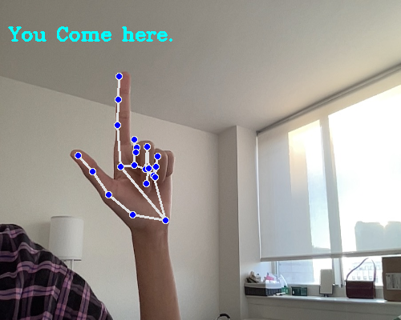
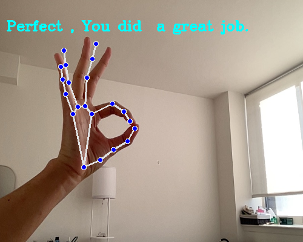
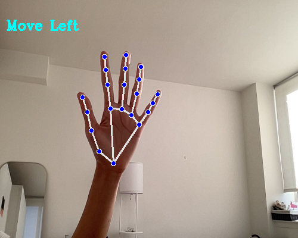
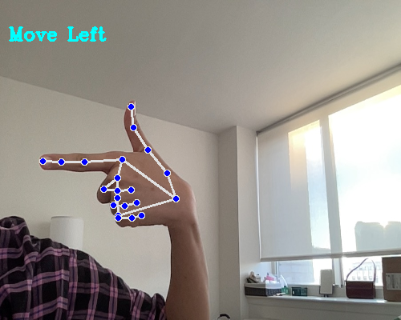
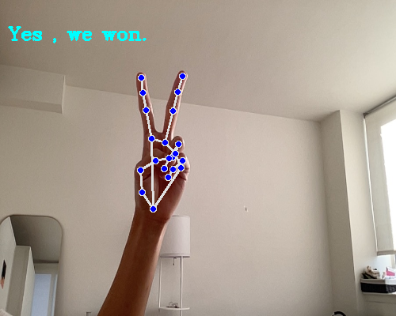

# Containerized App Exercise

## Description

The ASL interpreter app uses machine learning to recognize American Sign Language gestures from images captured from a live camera feed.

Designed for accessibility and ease of use, it offers a seamless, containerized experience that runs across three subsystems: gesture recognition, a web interface, and a database.

Following are some gestures the app can detect:







## Team

[Safia Billah](https://github.com/safiabillah)

[Melanie Zhang](https://github.com/melanie-y-zhang)

[Chloe Han](https://github.com/jh7316)

[Fatima Villena](https://github.com/favils)

## Configuration

First, clone the repository into your preferred IDE or terminal.

Then build the app using docker compose.  Run the command in the root directory of the project:

```bash
docker-compose up
```

This will start all three containers.

Once complete, you can check out the program for yourself at the url: http://localhost:5002/

Once in the browser, you will be prompted and asked to access your camera.  Just click "allow".

You can stop all three containers by clicking CRTL+C or enter into your terminal:

```bash
docker-compose stop
```

You can also stop AND remove all containers by running:

```bash
docker-compose down
```

## Task Board

[Task Board](https://github.com/orgs/software-students-fall2024/projects/119/views/1)
